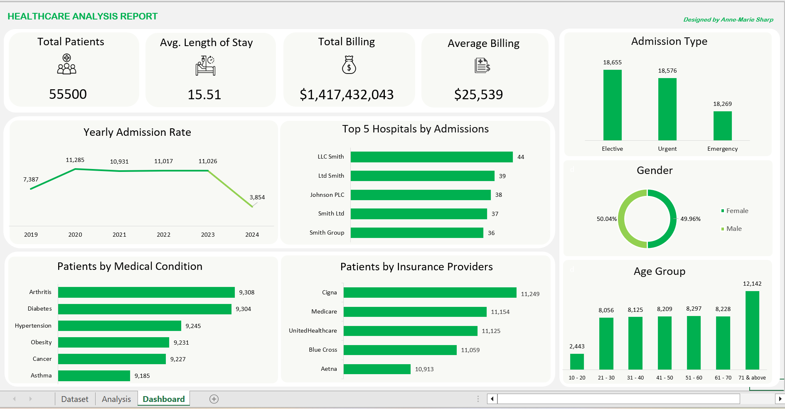

# Healthcare Admissions and Billing Analysis Dashboard

## 📊 Dashboard Preview

## Project Overview
This project presents a Microsoft Excel dashboard designed to provide an overview of patient admissions, billing patterns, and demographic distributions across multiple hospitals over a period of six years. The dataset used is synthetic and intended for analytical demonstration purposes.  
The dashboard focuses on descriptive healthcare reporting, highlighting trends, volumes, and distributions.

---

## Objectives
- Summarize overall patient volume and billing amounts  
- Track admission trends over time  
- Identify hospitals with high admissions  
- Analyze patient distribution by condition, age group, gender, insurance provider, and admission type  
- Present insights in a clear, executive-friendly Excel dashboard  

---

## Tools Used
- Microsoft Excel  

---

## Data Preparation & Transformation
- Standardized name formatting in Name column  
- Created calculated column for length of stay  
- Created age group categories for demographic analysis  

---

## Key Performance Indicators (KPIs)
- Total Patients  
- Average Length of Stay  
- Total Billing Amount  
- Average Billing Amount per Patient  

These KPIs provide a snapshot of overall hospital activity and billing scale.

---

## Key Insights

### Admission Trends
- Displays patient admission trends from 2019 to 2024.  
- Admissions peaked in 2020 with a sharp decline in 2024.  

### Top 5 Hospitals by Admissions
- Highlights hospitals with the highest patient intake.  
- LLC Smith leads in admission volume, followed by Ltd Smith and Johnson PLC.  

### Admission Type Distribution
- Breaks down admissions into Elective, Urgent, and Emergency categories.  
- Elective procedures represent the highest volume, followed closely by Urgent and Emergency admissions.  

### Patients by Medical Condition
- Shows patient volume across the different medical conditions.  
- Arthritis, Diabetes and Hypertension are the most common conditions in admitted patients.  

### Patients by Insurance Providers
- Displays patient counts by insurance provider.  
- Cigna and Medicare are the leading insurance providers.  

### Age Group Distribution
- Shows how patient volume varies across age ranges.  
- The 71+ age group has the highest patient count, while the 10–20 age group has the lowest.  

### Gender Distribution
- Provides demographic context.  
- Gender distribution is nearly equally balanced between Males and Females.  

---

## Files in This Repository
- **HealthcareDashboard.xlsx** – The complete Excel workbook with data and dashboard  
- **HealthcareDashboard-Screenshot.png** – Screenshot of the final dashboard  

---

## How to Use
1. Download the Excel file  
2. Open it in Microsoft Excel (2016 or later)  
3. Navigate to the Dashboard sheet  
4. Explore the visualizations and key metrics  

**Dataset source:**  
https://www.kaggle.com/datasets/prasad22/healthcare-dataset/data
